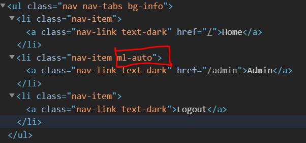
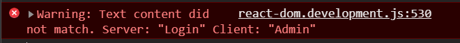

### This Readme will mostly cover the problems encountered and how i solved them

1. **Fragment** when used in react router component (Layout.js) gives an error when page reloaded

- When i travel to a page using Link or Redirection
  
  
- When i reload the page
  
  
  
